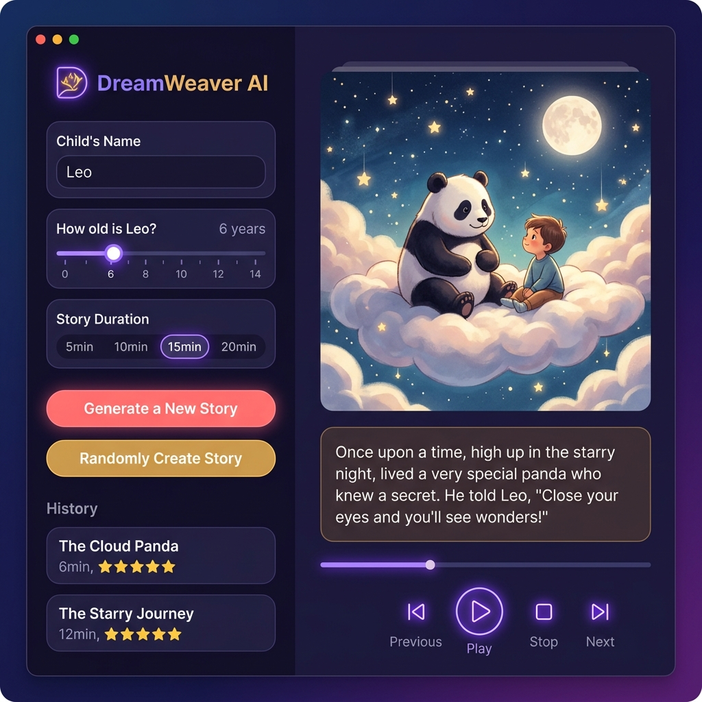

# DreamWeaver AI 🪄

> **Turning children’s toys, names, and imagination into personalized, interactive bedtime adventures.**



Every evening, parents face a common challenge: keeping bedtime stories fresh, engaging, and aligned with their children's rapidly changing interests. At the same time, children have incredible, fleeting bursts of imagination—pointing at a toy panda, mentioning a spaceship, or wanting to be the hero of their own space race. 

**DreamWeaver AI** bridges the gap. It is a local Windows application that captures multimodal inputs (webcam image + microphone speech), processes them using the Google Gemini API, and outputs a personalized, time-calibrated audio storybook (1 cover image, 3 scene illustrations, and TTS audio narration) for children.

For tech architecture details, see [ARCHITECTURE.md](file:///d:/gitfolder/DreamWeaverAI/ARCHITECTURE.md).

---

### 🌟 Key Product Features

*   **You Are the Hero (Personalized Names):** Input your child's name (like *Lele*). The AI seamlessly weaves them into the story as the brave main character.
*   **Bring Toys to Life (Camera Integration):** Hold a toy up to the laptop camera. DreamWeaver AI "sees" the toy (e.g., a stuffed Panda or a reindeer) and instantly writes it into Lele's adventure as a sidekick or a magical guide.
*   **Voice Spark (Mic Integration):** Tell the app what you want to happen. Speak a setting like *spaceship* or *the moon* to guide the narrative direction.
*   **Time-Capped Bedsides (10 & 15-Minute Settings):** The app dynamically paces the length of the audio narration to hit your target bedtime window perfectly.
*   **Safe & Age-Appropriate:** A built-in guardrail system automatically adjusts vocabulary, story complexity, and emotional themes based on the selected age (e.g., keeping things light, whimsical, and comforting for a 6-year-old).
*   **Digital Storybook Mode:** 
    *   Generates **1 beautiful cover illustration** and **3 key scene illustrations** to display on-screen like a digital book while the audio plays, giving your child a cozy visual anchor without hyper-stimulating video loops.

---

### 🚀 How It Works for a Parent & Child

1. **Launch & Choose:** Open the app on your Windows laptop. Input your child's name (e.g., *Lele*) and select their age and a **10** or **15-minute** limit.
2. **Spark the Story:** Let your child hold up an object to the webcam, or press the "Speak" button to say their ideas.
3. **Generate:** Click **Create My Storybook**.
4. **Relax:** Snuggle up, watch the custom-drawn scenes change on screen, and listen to a completely unique, personalized bedtime adventure.

---

## 💻 Step-by-Step Environment Setup & Replication

Follow these instructions to recreate the environment and run the code on a clean, secondary machine.

### 📋 Prerequisites
- **Python 3.12** (Make sure Python is added to your system PATH)
- **Windows 10/11** (Optimized for Windows desktop environments)
- **Git** (For cloning the repository)

### 1. Clone the Repository
```powershell
git clone https://github.com/Victoria-Chu/DeamWeaverAI.git
cd DeamWeaverAI
```

### 2. Set Up Python Virtual Environment
Initialize a fresh isolated virtual environment named `.venv`:
```powershell
python -m venv .venv
```

Activate the virtual environment:
- **PowerShell / Command Prompt (Windows):**
  ```powershell
  .venv\Scripts\activate
  ```
- **Bash / Linux / macOS (Fallback):**
  ```bash
  source .venv/bin/activate
  ```

### 3. Install Dependencies
Ensure pip is updated and install the required libraries:
```powershell
python -m pip install --upgrade pip
pip install -r requirements.txt
```

*Note: PyAudio may require building tools on some platforms if a wheel is not available. Ensure you have the Microsoft C++ Build Tools installed if you encounter errors compiling PyAudio.*

### 4. Configure Environment Variables
Copy the template `.env.example` to `.env`:
```powershell
copy .env.example .env
```
Open `.env` and fill in your Google Gemini API key:
```env
GEMINI_API_KEY=your_actual_gemini_api_key_here
```

### 5. Running the Application

You can launch either the CustomTkinter Desktop Application or the Streamlit web browser prototype:

- **Desktop Application (CustomTkinter):**
  ```powershell
  python src/app_gui.py
  ```
- **Streamlit Prototype (Web Browser UI):**
  ```powershell
  streamlit run src/app.py
  ```

### 6. Running Tests
You can run automated tests to verify the core orchestrator and inputs logic:
```powershell
python -m pytest
```
